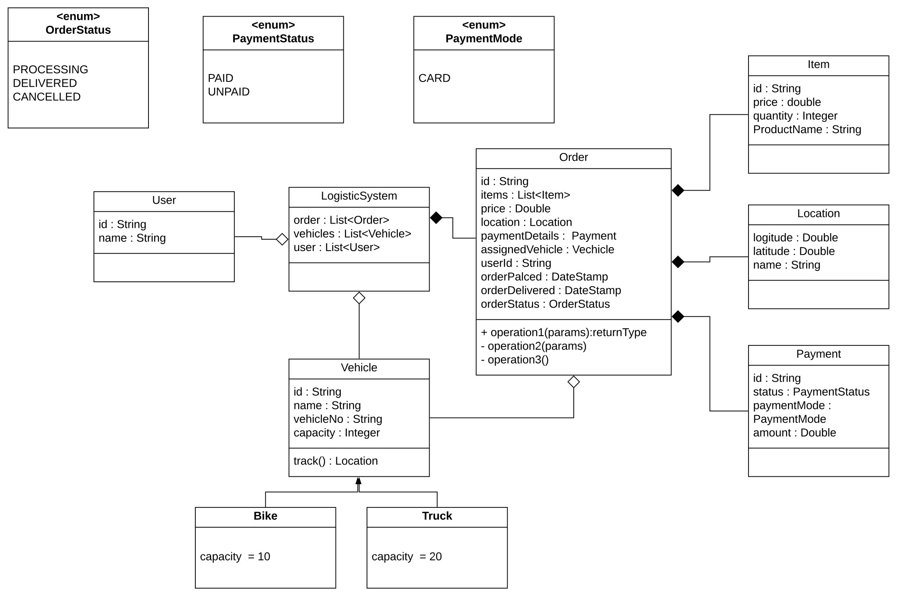

# Requirments : 
- The system can take an order to deliver it to a given destination.
- The order will be a list of items and there is a cost of each order to process.
- User has to register himself / herself to use this system.
- User can track his / her order.
- Orders will be shipped by bike or truck, but only a single order will be shipped by a single vehicle.

# Class diagram
